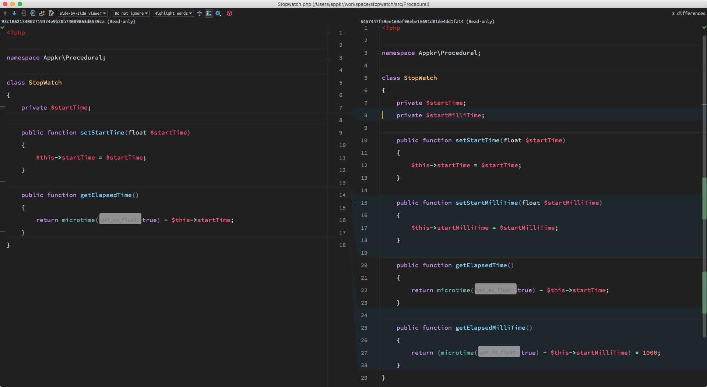
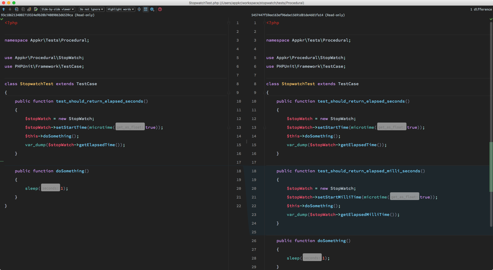
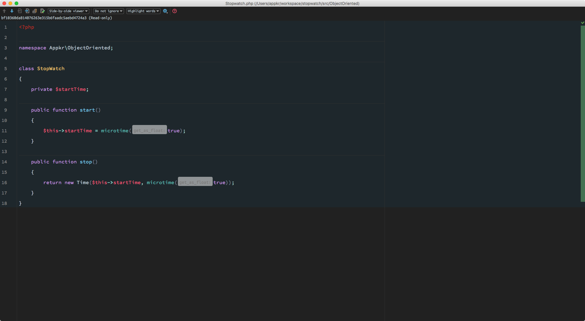
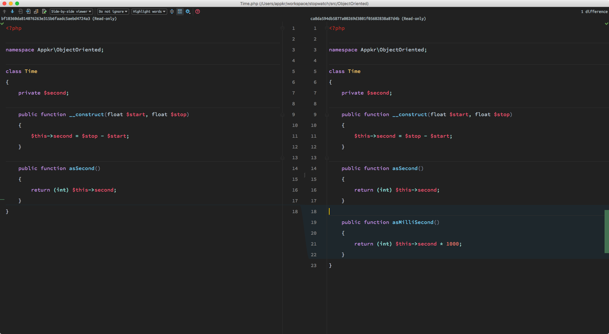
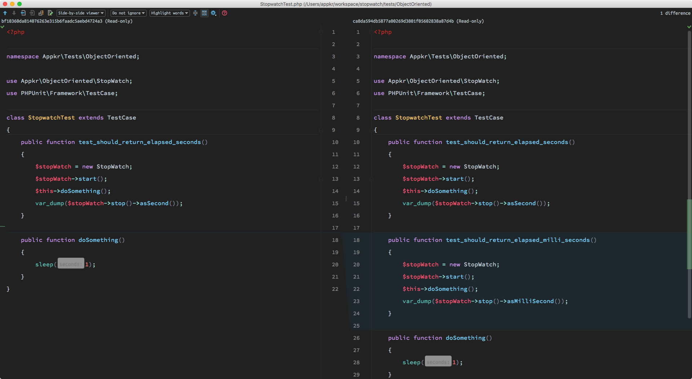

# 절차지향과 객체지향

초 단위 스톱워치 기능을 제공하다가, 밀리초 단위의 스톱워치 기능을 추가해 달라는 요구사항이 추가되었을 때, 절차지향과 객체지향의 차이를 묘사하기 위한 샘플 프로젝트입니다.

## 1. 절차지향

라이브러리의 기능 추가로 인해 클라이언트가 변경되어야 합니다.





## 2. 객체지향

클래스 내부의 구현을 감추고, 데이터를 한번 더 추상화한 `Time`이란 Value Object를 도입했습니다.







## 3. 테스트

```bash
$ composer install
$ vendor/bin/phpunit tests --color
```